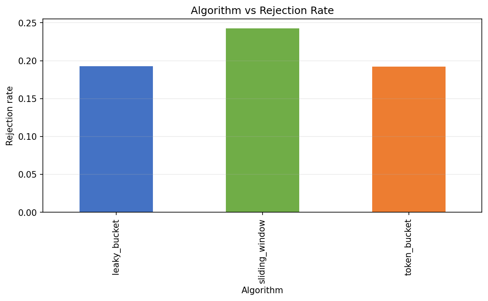
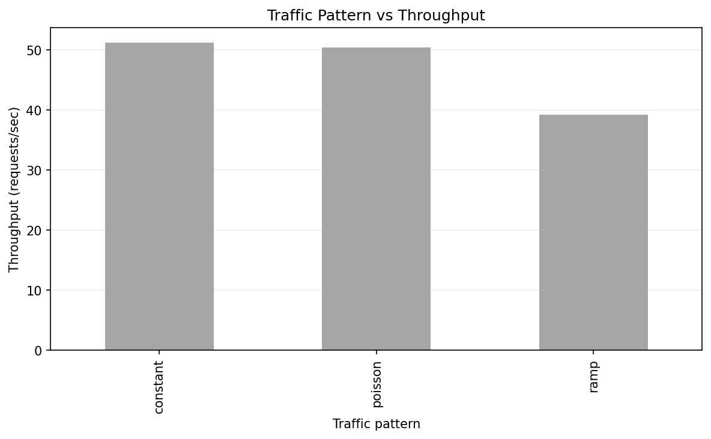
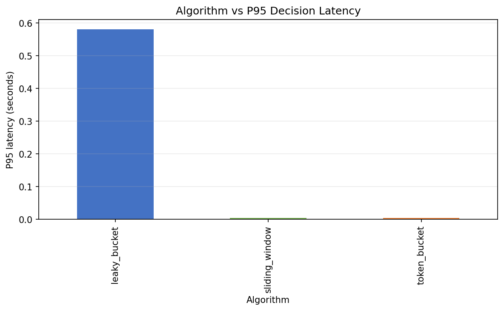

<div align="center">

# Rate Limiter Simulator

**A simulation framework for evaluating rate-limiting algorithms under different traffic patterns and distributed-system conditions.**

</div>

---

## Overview

Rate limiting is an essential mechanism for protecting services from excessive traffic. However, different rate-limiting strategies can behave differently depending on workload, system architecture, and network conditions.

This project provides a configurable simulation environment to **compare rate-limiting algorithms** under controlled workloads and measure their performance using latency, throughput, rejection, fairness, and overshoot metrics.

The detailed implementation and methodology behind the algorithms and traffic models are documented in **[`METHODOLOGY.md`](METHODOLOGY.md)**.

---

## Features

- Compare **Sliding Window, Token Bucket, and Leaky Bucket** algorithms
- Simulate **Constant, Poisson, and Ramp** traffic patterns
- Evaluate **Local and Distributed** architectures
- Model distributed **coordination latency and failures**
- Run **Monte Carlo experiments** with reproducible seeds
- Measure latency, throughput, rejection, fairness, and rate-limit overshoot
- Generate CSV results and performance plots automatically

---

## Metrics

| Metric | Description |
|---|---|
| **Throughput** | Number of accepted requests per second |
| **Acceptance Rate** | Percentage of incoming requests accepted |
| **Rejection Rate** | Percentage of incoming requests rejected |
| **P95 Latency** | 95th percentile latency of accepted requests |
| **Jain's Fairness Index** | Measures how evenly requests are distributed across users |
| **Limit Overshoot** | Maximum percentage by which the configured rate limit is exceeded |

---

## Results

The simulator generates plots from the experiment results to compare algorithms and system conditions.

### Algorithm vs Rejection Rate



### Traffic Pattern vs Throughput



### Algorithm vs P95 Latency



> More detailed results and analysis can be added as the experimental evaluation evolves.

---

## Installation

```bash
git clone https://github.com/AnarvaKamdar1/Rate-Limiter-Simulator.git
cd Rate-Limiter-Simulator

python -m venv .venv
source .venv/bin/activate       # Linux/macOS
# .venv\Scripts\activate        # Windows

pip install numpy pandas matplotlib
```
Run a simulation:

```bash
python run.py
```

Run the complete experiment suite:

```bash
python all.py
```

Generate all plots:

```bash
python analyze.py --plot all
```

## Limitations

- This is a simulation environment, not a production rate-limiting implementation.
- Network latency and failures in distributed mode are modeled rather than measured from real infrastructure.
- Results depend on the configured workload and simulation parameters.
- The current distributed model uses fail-closed behavior.
- The simulator focuses on a limited set of rate-limiting algorithms and traffic models.
